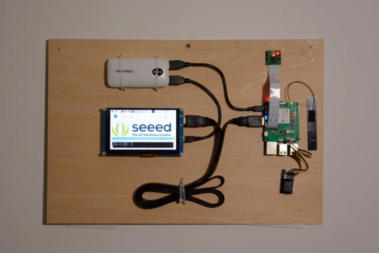
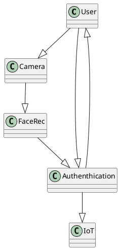
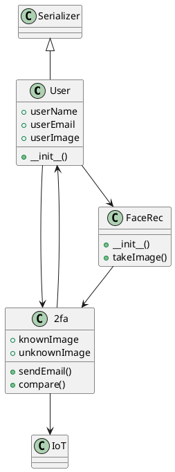
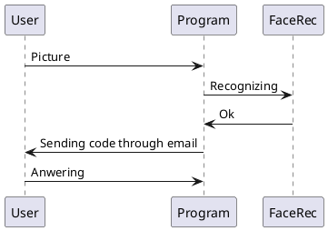

# IoT Face Recognition

## Tekijät

* Samson Azizyan (M3156) 
* Arttu Häyrynen (M3350) 
* Tuukka Bordi (M2296) 
* Jaber Askari (M2947)
* Versionumero 0.2

## Sisällysluettelo 

* [Vaatimusmäärittely](#vaatimusmäärittely)
    * [Järjestelmän yleiskuvaus](#järjestelmän-yleiskuvaus)
    * [Kohdeyleisö](#kohdeyleisö)
    * [Käyttöympäristö ja käytetyt teknologiat](#käyttöympäristö-ja-käytetyt-teknologiat)
    * [Komponentit](#komponentit)
    * [Käyttäjäroolit](#käyttäjäroolit)
    * [Käsitemalli](#käsitemalli)
    * [Luokkakaavio](#luokkamalli)
    * [Työnjako](#työnjako)
    * [Työaikasuunnitelma](#työaika-suunnitelma)
* [Loppuraportti](#loppuraportti)
    * [Asennus](#asennus)
    * [Tetoa ohjelmasta](#tietoa-ohjelmasta)
    * [Kuvaruutukaappaukset](#kuvaruutukaappaukset)
    * [Mukana tulevat tiedostot](#mukana-tulevat-tiedostot)
    * [Tietokanta](#tietokanta)
    * [Ongelmat, jatkokehitysideat](#ongelmat-jatkokehitysideat)
    * [Työmäärä](#työmäärä)
    * [Yhteenveto](#yhteenveto)

# Vaatimusmäärittely

## Järjestelmän yleiskuvaus

### Johdanto

Kurssin alussa saimme tehtävän suunnitella ja rakentaa IoT-järjestelmä. Ryhdyimme lähestymään tätä sillä ajatuksella, että haluamme tehdä järjestelmän, jonka koemme itsellemme mielekkääksi ja jonka rakentaminen opettaisi meille samalla jotain uutta. Ryhdyimme tutkimaan internetin tee-se-palstoja ja siinä toiveessa, että löytäisimme projektin, joka soveltuisi kurssin vaatimuksiin, olisi mielekäs toteuttaa ja johon olisi olemassa jo valmiiksi hyviä ohjeita ja vinkkejä. Totesimme heti aluksi, että emme halua tehdä sitä perinteistä sääasema -projektia, vaan haluamme tähdätä hieman korkeammalle. Tästä syystä päädyimme tutkimaan projekteja, jotka eivät itsessään ole ns. IoT -projekteja, mutta olisivat mukautettavissa sellaisiksi.  

Päädyimme suunnittelemaan kasvojentunnistusjärjestelmän, joka rakentuu Raspberry Pi:n ja sen kameramoduulin varaan. Laajensimme järjestelmän langattomia ominaisuuksia ottamalla projektiimme mukaan ESP32 –laitteen, jonka kanssa on tarkoitus kommunikoida langattomasti. Raspberry Pi suorittaa varsinaisen kasvojentunnistuksen ja ESP32 mahdollistaa järjestelmän ulkopuolisten laitteiden ohjauksen. Käytimme lähtökohtana Seeed studion älylukko projektia, jossa kasvojentunnistusta käytetään sähkölukon ohjaukseen. 

Järjestelmämme tarkoituksena on toimia käyttäjän autentikoinnin välineenä ja tuoda kaksivaiheinen autentikointi eli 2FA reaalimaailmaan. 2FA:n ollessa yleinen menetelmä kirjautua monille internet sivustoille, halusimme luoda järjestelmän, joka mahdollistaa sen vaivattoman käytön myös muissa ohjaus- ja valvontakäytöissä.  

Ensimmäiset kunnianhimoiset ajatukset olivat luoda järjestelmä kahvinkeittimen ohjaamiseksi, jossa kasvojentunnistusta käytetään menetelmänä, jolla järjestelmävalvoja voi myöntää tai kieltää käyttäjältä kahvinkeittimen käyttöluvan. Tästä luovuttiin kuitenkin hyvin pian koska totesimme sellaisen järjestelmän olevan tarpeettoman monimutkainen tehtävänantoon nähden. Päädyimme suoraviivaistamaan järjestelmää ja ohjaamaan yksinkertaista LEDiä, kahvinkeittimen sijaan, koska tehtävänantona oli osoittaa järjestelmän toimivuus eikä niinkään luoda lopullinen tuote. Tämä ratkaisi monia ongelmia mitä tulee heikko- ja vahvavirtajärjestelmien sulauttamisen yhteydessä.  

[Linkki projekti-ideaan](https://project.seeedstudio.com/SeeedStudio/face-recognization-smart-lock-with-lte-pi-hat-abcec9)

## Kohdeyleisö
Perus ATK-osaamisen omaava henkilö. Ihan jokainen, jolla on s-posti voi olla tämän teknologian käyttäjä.
## Viikko raportit
### Viikko 43
#### Mitä tehtiin
Asennettiin kaikki kirjastot kasvojentunnistusta varten
Kokeiltiin ohjelmantoimtaa
Tutkittiin ESP toimintoja
Kirjoitettiin lyhyt testiohjelma joka käytti kasvojentunnistusta
#### Kohdattuja ongelmia
Dlib kirjasto ei asentunut kunnolla, ongelma saatiin korjattua lainaamalla kovalevyltä välimuistia eli lisäämällä swap muistin määrää. GPU:lta otettiin myös muistia pois 64:stä 16 MB 
OpenCV kirjaston kanssa oli asennusongelma joka korjautui poistamalla se, asentamalla libatlas-base-dev, libjasper-dev, libqtgui4, python3-pyqt5 ja sen jälkeen asentamalla OpenCV-python
#### Seuraavat askeleet
Suunnitellaan ohjelman tarkempi toiminta.

### Viikko 47
#### Mitä tehtiin
Muokattiin face_recognition softaa nopeammaksi ja lisättiin uusi ominaisuus kuvien tallentamiseksi levylle. Ennen kuvat tallennettiin ensin levylle, jonka jälkeen ne encoodattiin. Tämä oli hidas prosessi. Nyt kuvat tallennetaan numpy-array-muotoon tietokoneen välimuistiin.

#### Kohdattuja ongelmia
Koska Raspberry ja koodaaja olivat eri paikoissa, testaus oli osin hidasta ja turhauttavaa (push ja pull x monta kertaa). Korjattiin bugeja koodista, mutta emme saaneet softaa vielä täysin toimimaan. Viimeisin bugi koski vieläpä koodin osa-aluetta, johon ei edes koskettu ja joka toimi edellisellä suorituskerralla. Epäilemme, että vika on jossain kuvassa ja että tämän takia face_recognition kirjasto tekee encoodauksen virheellisesti (jonka takia kirjaston compare-faces-funktio kaatuu). Lisäsimme tämän tunnistusta varten debugging-koodia, jonka testaamiseen palaamme maanantaina 25.11.
#### Seuraavat askeleet
Saada kaikki ohjelmiston osaset toimimaan yhdessä. ESP-koodin lisäys main-koodiin ja sen testaus. Kuvat levylle tallentavan koodin lisäys koodiin johonkin kohtaan, jossa se ei kohtuuttomasti hidasta ohjelman toimintaan (vaikkapa siihen kohtaan, jossa odotetaan sähköpostitunnistautumista).

Jos aika riittää, niin nämä asiat:
* käyttää grove-nappia kuvan ottamiseen (koodi valmiina grove-napille)
* lisätä text-to-speech-ominaisuus
* lisätä hälytysfunktio, jos sama henkilö epäonnistuu tunnistautumisessa kolme kertaa (perusta tälle jo valmis)
** tähän voisi käyttää vaikka grove-buzzeria, joka löytyy eräältä tiimin jäseneltä (buzzer koodi jo valmis).
* Aloittaa loppuraportin teko

## Käyttöympäristö ja käytetyt teknologiat

Projekti vaatii seuraavat Linux-kirjastot: 
* build-essential
* cmake 
* gfortran 
* git 
* wget 
* curl 
* graphicsmagick 
* libgraphicsmagick1-dev 
* libatlas-dev 
* libavcodec-dev 
* libavformat-dev 
* libboost-all-dev 
* libgtk2.0-dev 
* libjpeg-dev 
* liblapack-dev 
* libswscale-dev 
* pkg-config 
* python3-dev 
* python3-numpy 

Python-komponenteista tarvitsemme nämä:

* https://github.com/ageitgey/face_recognition.git - python-kirjasto, jota käytämme kasvojen tunnistamiseen
* GPIO -kirjasto, jota käytetään GPIO-pinnien ohjaukseen
* picamera -kirjasto kameran ohjaukseen
* PIL / Image -kirjastoa kuvan esittämiseen näytöllä tunnistautumisen yhteydessä

Muita valinnaisia kirjastoja, joista saattaa olla hyötyä: time, os, numpy, matplotlib.pyplot

Lisäksi käytämme tunnettuja Linux / Python-kirjastoja ESP32:n ohjaukseen

## Komponentit

* Raspberry Pi 3 Model B
* Raspberry Pi Camera Module
* [Grove - Relay](https://project.seeedstudio.com/products/grove-relay)
* ESP32

## Käyttäjäroolit
### Teknologian käyttäjä
Hallitse teknologian avaulla pääsyn päätelaitteeseen.

### Teknologian ylläpitäjä
Ylläpitää teknologian toimivuutta, päivittää tietokantaa.

## Käsitemalli

## Luokkakaavio

## Sekvenssikaavio

## Käyttötapaukset

Ohjelma toimii seuraavasti näissä käyttötilanteissa: 

* Käyttäjä ottaa kuvan, mutta käyttäjää ei tunnisteta: ohjelma alkaa hälyttää summerilla 2 sekuntia 

* Ohjelma ottaa kuvan, käyttäjä tunnistetaan mutta käyttäjä ei lähetä salasanaa tunnistusohjelman hallinnoimaan sähköpostiin: ajan loputtua (n. 2 min) laite laskee epäonnistuneen yrityksen, ei sytytä lediä (joka olisi onnistuneen autentikoinnin merkki), tallentaa kuvan tuntemattomasta käyttäjästä aikaleimoineen ja palaa kasvojentunnistukseen 

* Sama käyttäjä yrittää tunnistautua 3 kertaa mutta epäonnistuu joka kerralla: laite alkaa hälyttää summerilla 2 sekuntia 

* Laite ottaa kuvan, käyttäjä tunnistetaan mutta käyttäjä lähettää väärän salasanan tunnistusohjelman hallinnoimaan sähköpostiin: ohjelma ei tee mitään ennen kuin autentikoinnin aika kuluu umpeen. 

* Laite ottaa kuvan, käyttäjä tunnistetaan, käyttäjä lähettää oikean salasanan autentikointiajan sisällä: laite lähettää verkon kautta komennon ESP32-laitteelle joka sytyttää ledin. 

* Autentikointiaika on määritetty auth-moduulissa, kuvan ottaminen ja sen vertaaminen nykyisiin käyttäjiin tapahtuu cl_facerec –moduulissa niin kuin myös kuvan tallentaminen epäonnistuneiden yritysten jälkeen. Jos käyttäjän todentaminen onnistuu, aktivoidaan LED-valo ESP32-laitteessa tekemämme esp32client-moduulin kautta. 

## Työnjako

* Kasvojentunnistuskirjasto Raspberry Pi:lle
    * kameran ohjaus Pythonilla
* ESP32 → yhteys Raspberryyn
    * ESP32-fläshäys ja käyttöönotto
* ESP32 lediohjaus-ohjelman koodaus
• Dokumentointi
    * Vaatimusmäärittely
* Sensoreiden ja toimilaitteiden toiminta–
* Kuvaus verkoista, siirtoteistä ja – tekniikoista
* Verkkotopologia
* Kuvaus käytetyistä palveluista
* Sekvenssikaavio
* Flowchart
* Piirikaaviot

### Tulevaisuuden haaveet:
* text-to-speech-kone??
* 2-factor-authentication

### Tehtävänjako

* Arttu dokumentoi
* Tuukka toimii face recognitionin parissa yleisesti
* Samson saa ESP32:n flashattya/kommunikoimaan Raspberryn kanssa
* Jaber toimii raspberry pi:n kameran ohjauksen kanssa

## Työaikasuunnitelma

  

# Loppuraportti

## Asenus

## Kuvaruutukaapaukset

## Tietokanta

## Ongelmat, jatkokehitysideat

## Työmäärä

## Yhteenveto

* Yleinen selostus
* Koodi
* Komponentit
* Vaiheet
    * Kasvojentunnistus, SMS-kuluvalvonta
* Extravaiheet
    * Smart home   
    * Komponentit: wlan-kytkimiä
    * kaksivaiheinen tunnistautuminen / sms
    * kuva ja lupa sovelluksen avulla

Hyödyllinen dokumentaatio (kannattaa tutustua):
* [Kasvojentunnistus-kirjasto](https://github.com/ageitgey/face_recognition/blob/master/README.md)
* [Remote shell Micropythonille (ESP32):](https://github.com/dhylands/rshell)
* [Verkkosivupohjainen remote shell Micropythonille (ESP32):](https://github.com/Hermann-SW/webrepl#webrepl-shell)
* [Kätevät käyttöohjeet webrepl-shellille](https://forum.micropython.org/viewtopic.php?f=2&p=30829#p30829)
* [Toinen käyttöohje webreplille](https://docs.micropython.org/en/latest/esp8266/tutorial/repl.html)